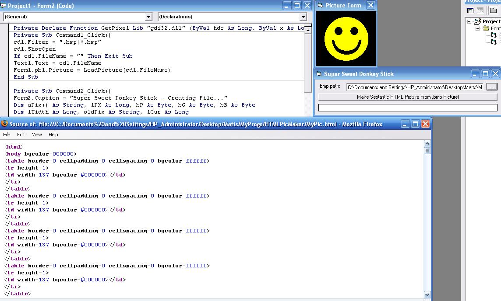

<div align="center">

## BMP To Pure HTML Pic Converter


</div>

### Description

Converts A BMP Image Into Pure HTML Code
 
### More Info
 
Cool Prog, But Somewhat Useless ;)

Uses GetPixel To Grab Pixel Functions And Prints The HTML Equivilent To Create A Pure HTML Picture

MyPic.html

The HTML File Is Huge... Obviously


<span>             |<span>
---                |---
**Submitted On**   |2007-10-15 07:19:00
**By**             |[Matt Pollock](https://github.com/Planet-Source-Code/PSCIndex/blob/master/ByAuthor/matt-pollock.md)
**Level**          |Advanced
**User Rating**    |5.0 (25 globes from 5 users)
**Compatibility**  |VB 6\.0
**Category**       |[Complete Applications](https://github.com/Planet-Source-Code/PSCIndex/blob/master/ByCategory/complete-applications__1-27.md)
**World**          |[Visual Basic](https://github.com/Planet-Source-Code/PSCIndex/blob/master/ByWorld/visual-basic.md)
**Archive File**   |[BMP\_To\_Pur20871810152007\.zip](https://github.com/Planet-Source-Code/matt-pollock-bmp-to-pure-html-pic-converter__1-69495/archive/master.zip)

### API Declarations

```
Private Declare Function GetPixel Lib "gdi32.dll" (ByVal hdc As Long, ByVal x As Long, ByVal y As Long) As Long
```


